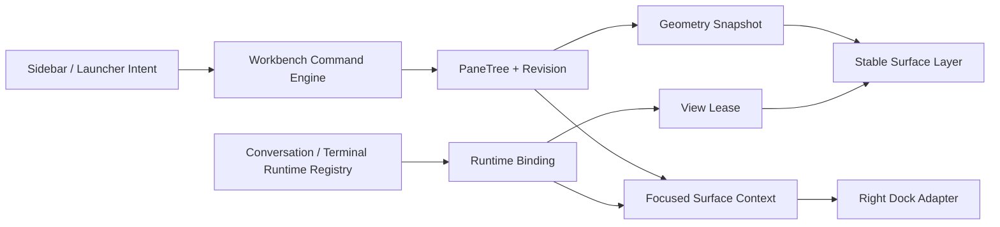

# 会话工作台可贴靠 Pane 架构设计

| 元数据 | 内容 |
|---|---|
| 状态 | Release baseline / 正式版实现基线（目标架构与当前实现边界分列记录） |
| 版本 | v0.5 |
| 日期 | 2026-08-20 |
| 适用基线 | PR #521 HEAD `31244950e56d18f454b7c230c2f1c3bfff9efbae`；Native Drop 跨 Pane 目标会话仍待修复 |

研究依据：[OTTY 多会话、分块、焦点与文件 Pane 架构拆解](../reverse-engineering/otty/1.3.1/pane-architecture.md) · [OTTY 当前实现](../reverse-engineering/otty/1.3.1/current-state.md)

> **当前实现说明**：本文件保留窗口级布局持久化、恢复和完整三平台验收等目标设计，不能将这些目标段落视为当前代码已启用的能力。正式版当前默认开启 Workbench，但启动时创建单 Root Pane，不恢复历史多 Pane 布局；`VITE_LIVEAGENT_SESSION_WORKBENCH=0` 仅用于回退。Native Drop 的命中坐标已覆盖多 Pane，但最终 upload 目标仍需在 drop 时同步绑定 `conversationId`，完成前不应宣称发布验收全部通过。

## 1. 本轮需求结论

LiveAgent 会话页应从：

```text
项目 / 会话侧栏 | 单一 Conversation + 页面级 ChatHeader | Right Dock
```

演进为：

```text
应用级顶部 Chrome
项目 / 会话侧栏 | 窗口级可贴靠工作台 | 固定 Right Dock
                   ├── Conversation Pane × N
                   ├── Local Terminal Pane × N
                   └── SSH Terminal Pane × N
```

本轮不是在旧会话页外面简单套一层拖拽容器，而是改变页面宿主关系：

1. 顶部右侧两个稳定按钮属于整个应用，不属于任何 Conversation Pane。
2. 模型与执行模式选择从 `ChatHeader` 下沉到每个会话的输入框工具栏。
3. 一个完整会话视图封装为独立、稳定、可移动的 `ConversationSurface`。
4. Conversation、Local Terminal、SSH Terminal 使用同一套 `PaneFrame`、贴靠、移动、关闭和紧凑模式。
5. 左侧拖动已有会话表示复用该会话；同一会话不会创建第二份 DOM 或 Runtime。
6. 左侧拖动工作区表示为该工作区新建会话，并把新会话放入投放位置。
7. 画板是窗口级而非项目级；不同工作区的会话可以并列，但每个 Pane 必须自带不可歧义的项目上下文。
8. 右侧文件树仍由应用右上角按钮展开，默认打开 Files；首期不把文件树做成可拖 Pane。
9. Right Dock 跟随当前聚焦 Pane 的项目上下文，但点击 Right Dock 不改变工作台业务焦点。
10. 底层继续使用可编码、可恢复的二叉 `PaneTree`，不使用长期重叠的自由浮窗。

这套能力在现有 React + Tauri + xterm.js 框架上可行，但难点已经从“终端贴靠”转移到“把 `ChatPage` 的单会话编排拆成按 `conversationId` 分桶的多实例控制器”。该拆分必须先完成，不能通过复制整份 `ChatPage` 绕过。

## 2. v0.5 对旧方案的修正

| 主题 | v0.4 | v0.5 决策 |
|---|---|---|
| 会话宿主 | 唯一 `activeConversation` Pane | 多个 `conversation` Pane，按 `conversationId` 唯一挂载 |
| 会话 ID | 布局不保存具体 ID | Conversation Spec 保存稳定 `conversationId`，运行数据仍不进布局 |
| 布局范围 | 每个项目一棵 PaneTree | 主窗口一棵 PaneTree，每个 Surface 自带 `ProjectRef` |
| 工作区切换 | 切换整棵项目布局 | 点击沿用导航；拖入则在当前画板新建该项目会话 |
| 会话拖入 | 后置能力，MVP 拒绝 | 核心能力；已有则移动/聚焦，未打开则插入 |
| 工作区拖入 | 未定义 | 创建该项目的新草稿会话，再原子插入目标位置 |
| 页面 Header | 全局 Chat Header 含模型选择 | `AppWorkbenchChrome` 只放应用级动作；模型选择进入 Composer |
| 右上角入口 | `ChatHeader.trailingActions` | 固定在 App Chrome，不随 Pane 移动 |
| 文件树 | 可成为中央 Folder Pane | 首期固定在 Right Dock，按钮展开时默认 Files |
| 终端 | 独立 Pane 类型 | 与 Conversation 共用 Pane 外壳、移动及紧凑策略 |
| 空画板 | 不允许，Conversation 不可关闭 | 允许；显示可投放的工作台空状态 |
| Right Dock 项目 | 当前激活项目 | 当前聚焦 Surface 的显式项目引用 |
| 实施顺序 | 先 Active Conversation Host | 先拆 Conversation Controller，再开放多会话 Pane |

保留 v0.4 中正确的边界：PaneTree/Runtime 分离、唯一交互 View Lease、整数几何、Revision CAS、未知 Surface 无损往返、Native Drop 坐标适配和三平台实机门槛。本机布局持久化仍是目标设计，当前正式版不启用。

## 3. 产品交互定义

### 3.1 应用级顶部 Chrome

顶部 Chrome 固定在工作台列顶部，不参与 PaneTree：

```text
┌──────────────────────────────────────────────────────────────┐
│ [打开侧栏]              LiveAgent              [主题] [文件] │
└──────────────────────────────────────────────────────────────┘
```

- 右上角稳定保留主题按钮和文件树按钮。
- 文件树按钮关闭时点击：打开 Right Dock，并选择 `files` Tab。
- 文件树按钮打开时点击：折叠 Right Dock。
- 当前侧栏关闭时出现的 Settings 是响应式回退动作，不应成为 Pane 内容；可以保留在 App Chrome 或全局菜单。
- 通知 Toast、窗口拖拽区和应用导航属于 App Chrome/Overlay，不属于 Conversation DOM。
- 只有标题栏空白区域设置 `data-tauri-drag-region`。Pane 拖柄绝不能带此属性，否则会把 Pane 移动误识别为原生窗口移动。

### 3.2 Conversation Pane

```text
ConversationSurface
├── PaneChrome
│   ├── 工作区名 / 会话标题 / 运行状态
│   └── 拖柄、更多、关闭
├── ChatTranscript
├── Progress / Approval / Queue
└── ChatComposerBar
    ├── 输入区 / 附件
    └── [模型 + 模式] [上传] [搜索] [思考] [分支] [发送]
```

模型选择器下沉后的规则：

- 复用当前 `ChatHeader` 中 Provider 分组、搜索、排序、Provider 设置入口和 Chat/Agent 模式分段器。
- 新建会话从全局默认模型初始化；之后选择状态按 `conversationId` 保存。
- 已开始的 Turn 使用发送时的模型快照，不因中途改模型而变化。
- Pane 变窄时只显示 Provider 图标和截断模型名；更窄时进入工具栏溢出菜单，不压住发送按钮。
- Popover 使用 Portal，不能被 Pane 的 `overflow: hidden` 截断。

### 3.3 左侧工作区与会话拖拽

| 来源 | 单击 | 拖到画板边缘/Divider | 已在画板中 |
|---|---|---|---|
| 已有会话 | 沿用现有选择/聚焦 | 打开并贴靠该会话 | 移动现有 Pane；不复制 |
| 工作区 | 沿用现有激活 | 新建该工作区会话并贴靠 | 始终新建一个会话 |
| 新建终端 | 自动贴靠聚焦 Pane | 在指定位置创建 | 每次创建新 Session |
| 已有 Pane | 聚焦 | 移动/交换 | 移动现有 Pane |

侧栏行已有单击、批量选择、长按菜单、重命名和管理动作，不能把整行粗暴设为 HTML `draggable`：

- 增加独立拖柄，或只允许从非交互文字区启动 Pointer Drag。
- 鼠标移动超过 6px 才进入拖拽；未超过阈值仍是点击。
- 触控长按菜单优先，首期通过“在工作台打开”菜单替代触控拖动。
- 重命名、批量选择、菜单打开、删除确认期间禁用拖拽。
- 拖影只显示标题、工作区和类型，不复制真实 Conversation DOM。

### 3.4 投放与贴靠

- `canvasEdge`：以整棵树为一侧做根级上、下、左、右分割。
- `paneEdge`：在目标 Pane 上、下、左、右分割。
- `divider`：插入已有分割线的一侧。
- `paneCenter`：只用于移动现有 Pane 的交换；侧栏新内容不静默覆盖目标。
- `canvasEmpty`：空画板中创建 Root Leaf。

侧栏 Payload 投到 Pane 中心时采用确定性自动贴靠：优先右侧，空间不足则下方，再查找最近可分割祖先；仍不满足硬最小尺寸则拒绝，且不会先创建 Runtime。

### 3.5 “压缩”的准确含义

Pane 压缩不使用 `transform: scale()`：

- Split Ratio 受 Surface 硬最小尺寸约束。
- 低于舒适宽度后进入 `compact`，隐藏次要标题、将工具栏收入菜单。
- Conversation 保证输入区、发送和模型入口始终可达。
- Terminal 执行 xterm Fit，最终才向 PTY 发送去重后的 cols/rows。
- 极窄窗口只显示聚焦 Pane，其余 Pane 暂停高成本绘制，不修改持久 PaneTree。

## 4. 目标与非目标

### 4.1 首期目标

1. 同一窗口并列显示多个工作区的多个会话和终端。
2. 支持上下左右贴靠、根级分割、Divider 插入、交换、移动、调比、均分和关闭。
3. 会话移动不丢草稿、队列、审批、滚动、流式输出或输入状态。
4. 终端移动不重新 Attach、不丢输出、不重启进程。
5. 模型与模式选择位于每个 Conversation Composer。
6. 右上角文件按钮始终可找到，并默认在固定 Right Dock 打开 File Tree。
7. 工作区拖入创建新会话；会话拖入复用既有会话。
8. Right Dock 始终使用聚焦 Pane 的受校验项目上下文。
9. **目标架构**支持本机恢复布局，异常引用可修复；当前正式版从单 Root Pane 启动，新旧 UI 可由 Feature Flag 回退。
10. macOS、Windows、Linux 共用布局内核并通过实机矩阵。

### 4.2 首期非目标

- 不支持 Pane 撕出为第二个原生窗口。
- 不支持长期悬浮、重叠、自由坐标和任意缩放卡片。
- 不允许同一 Conversation 或 Terminal Session 同时出现两个可输入视图。
- 不把 File Tree、Git Review、Tunnel、Tasks、Skills Hub、MCP Hub 放入 PaneTree。
- 不做完整文件编辑器和 Pane Tab Stack。
- 不自动恢复 Shell 进程，不自动提交 SSH 凭据或信任 Host Key。
- 不经 Gateway 同步窗口布局、Session ID、草稿或桌面 Feature Flag。
- 不把外部任意目录拖入后自动授权为工作区。

## 5. 当前代码基线与差距

### 5.1 当前页面是单会话总编排器

[`ChatPage.tsx`](../../crates/agent-gui/src/pages/ChatPage.tsx) 当前直接组装唯一一套 `ChatTranscript` 与 `ChatComposerBar`，并通过 `currentConversationId` 注入历史、运行、审批、队列、上传和草稿状态。`ApplicationView` 再在内容上方渲染一个 `ChatHeader`。

因此不能克隆 `chat.content`，必须拆成：

```text
ChatPage（迁移后可更名 ChatWorkbenchPage）
├── AppWorkbenchChrome
├── ChatHistorySidebar
├── ConversationRuntimeRegistry   keyed by conversationId
├── WorkbenchController
├── WorkbenchCanvas
└── RightDockPanel
```

### 5.2 模型选择目前耦合在 Header

[`ChatHeader.tsx`](../../crates/agent-ui/src/components/chat/ChatHeader.tsx) 同时拥有模型 Popover、Provider 分组/搜索/排序、模式切换、主题、设置和尾部动作。需要拆成：

```text
AppWorkbenchChrome
├── ThemeToggle
└── FileTreeToggle

ComposerModelPicker
├── ModelPickerTrigger
├── ProviderModelPickerContent
└── ExecutionModeSegment
```

模型领域数据由 Conversation Controller 提供；共享 UI 不直接访问 Tauri 或页面全局状态。

### 5.3 Composer 已有合适落点

[`ChatComposerBar.tsx`](../../crates/agent-ui/src/pages/chat/ChatComposerBar.tsx) 底部已有上传、Web Search、Thinking、Reasoning、Git Branch 和发送控制。模型入口放在左侧工具组首位，并传结构化合同：

```ts
type ComposerModelSelection = {
  hasModels: boolean;
  currentLabel: string;
  options: SharedModelOption<ProviderId>[];
  selectedValue?: string;
  executionMode: "text" | "tools" | "agent-dev";
  onSelectModel(selection: SelectedModel): void;
  onSelectExecutionMode(mode: "text" | "tools"): void;
  onOpenProviderSettings(providerId: string): void;
};
```

### 5.4 Right Dock 已处于正确层级

当前 `RightDockPanel` 已是 `ApplicationView` 的兄弟节点，适合继续作为固定区域。需要改的是：

- `ProjectToolsPanelToggle` 进入 `AppWorkbenchChrome`，明确 `openFiles()` 语义。
- `projectPathKey/cwd/projectState/fileTreeState` 从 `FocusedSurfaceContext` 解析。
- Workbench 模式下，Right Dock 不再挂载已被 Pane 占用的 `XTermViewport`。

### 5.5 侧栏交互冲突

`HistoryRow` 与 `ProjectRow` 已承担选择、重命名、批量操作、长按和菜单。新增拖拽必须复用统一 `SidebarSurfaceDragHandle`，并把 Drag Session 提升到工作台控制器，不能在两个 Row 内各做一套命中算法。

## 6. 产品层级与视觉结构

```text
┌──────────────┬──────────────────────────────────────────────┬─────────────────┐
│              │ App Chrome                         [◐] [Files]│                 │
│ 工作区        ├──────────────────────┬───────────────────────┤ Right Dock      │
│ 会话          │ Conversation A       │ Conversation B        │ focused project │
│              │ transcript/composer  │ transcript/composer   │ File / Git      │
│ draggable    ├──────────────────────┴───────────────────────┤ SSH / Tasks     │
│ sources      │ Local / SSH Terminal                         │                 │
└──────────────┴──────────────────────────────────────────────┴─────────────────┘
```

固定层级：

```text
AppShell
├── LeftSidebar
├── MainColumn
│   ├── AppWorkbenchChrome
│   └── WorkbenchCanvas
├── RightDock
└── GlobalOverlayHost
```

视觉沿用 LiveAgent 主题、字体和密度，只把“贴靠轨道”作为标志性交互：

- Pane Header 建议视觉高度 36px，按钮命中区至少 44×44px。
- 活动 Pane 仅增加 1px 焦点边界和标题对比。
- 拖动时才显示四向轨道、中心交换区和最终矩形预览。
- 内容直接铺满 Pane，不再套装饰性卡片。
- Divider 默认克制，hover/focus 时反馈；实际命中宽度 8～12px。
- 标题可省略，Tooltip 显示完整会话、工作区、路径或主机名。

## 7. 总体架构与状态所有权



| 层 | 权威内容 | 禁止保存 |
|---|---|---|
| Conversation Registry | 草稿、队列、审批、流、历史、模型 | Pane Rect |
| Terminal Registry | PTY/SSH、输出、Resize、退出状态 | Pane Rect |
| Runtime Binding | paneId 到 conversation/session/operation | 可持久布局 |
| View Lease | 哪个 Pane/旧容器拥有交互视图 | 业务数据 |
| Surface Spec | 可恢复身份和启动规格 | Secret、Prompt、Session ID、临时错误 |
| PaneTree | Leaf/Split/Ratio/Focus/Revision | ReactNode、Runtime 对象 |
| Context Adapter | 聚焦 Pane 的安全项目投影 | 新权限、隐式 cwd 所有权 |

## 8. 核心领域模型

### 8.1 Surface Spec

```ts
type ProjectRef = {
  projectId: string;
  projectPathKey: string;
};

type KnownWorkbenchSurface =
  | { kind: "conversation"; conversationId: string; project: ProjectRef }
  | { kind: "localTerminal"; project: ProjectRef; launchSpec: LocalTerminalLaunchSpec }
  | { kind: "sshTerminal"; project: ProjectRef; launchSpec: SshTerminalLaunchSpec };

type WorkbenchSurfaceSpec =
  | KnownWorkbenchSurface
  | {
      kind: "unsupported";
      originalKind: string;
      raw: Readonly<Record<string, unknown>>;
    };
```

Conversation ID 必须持久化，因为它是“复用已有会话”的稳定身份；消息、草稿、运行状态和模型配置仍由 Conversation Store 管理，不复制到布局 JSON。

两种终端 Surface 的 `launchSpec.cwd` 语义一致：它是**本地 project 锚点**（SFTP 的 local root），不是远端工作目录——`create_ssh` 与本地终端一样在本地 canonicalize 它。因此 `terminalLaunchSpecIsInProject` 的包含性校验对 `localTerminal` 与 `sshTerminal` 同样生效。

### 8.2 PaneTree

```ts
type PaneRecord = {
  paneId: string;
  surface: WorkbenchSurfaceSpec;
  view: { compactChrome?: boolean };
};

type PaneNode =
  | { type: "leaf"; paneId: string }
  | {
      type: "split";
      splitId: string;
      axis: "horizontal" | "vertical";
      ratio: number;
      first: PaneNode;
      second: PaneNode;
    };

type PersistedWorkbenchLayout = {
  schemaVersion: number;
  scopeId: "main-window";
  revision: number;
  root: PaneNode | null;
  panes: Record<string, PaneRecord>;
  focusedPaneId: string | null;
};
```

`horizontal` 表示左右，`vertical` 表示上下；空画板以 `root: null` 表达。

### 8.3 不变量

1. Tree 中每个 Leaf 恰好对应一个 PaneRecord，反之亦然。
2. Split 恰好有两个非空子节点，ratio 经过最小尺寸钳制。
3. 同一 `conversationId` 最多存在一个 Pane。
4. 同一 Terminal/SSH Session 最多存在一个可输入 View Lease。
5. `focusedPaneId` 为 null 当且仅当 root 为 null；否则指向现存 Leaf。
6. 结构编辑只通过带 `expectedRevision` 的事务提交。
7. 未知 Surface 原始 JSON 无损往返，不能派生能力或启动 Runtime。
8. ProjectRef 校验失败时进入 blocked/stale，不回退到另一个项目。
9. Layout 不包含 Secret、Prompt、输出、上传内容或临时错误。
10. 移动不改变 `paneId`、Surface 身份、Runtime Binding 或 React Key。

## 9. Conversation Runtime 重构

```ts
type ConversationSurfaceController = {
  conversationId: string;
  project: ProjectRef;
  transcript: ConversationTranscriptSlice;
  composer: ConversationComposerSlice;
  execution: ConversationExecutionSlice;
  approvals: ConversationApprovalSlice;
  model: ConversationModelSlice;
  lifecycle: ConversationLifecycleSlice;
};

type ConversationRuntimeRegistry = {
  get(conversationId: string): ConversationSurfaceController;
  ensure(input: { conversationId: string; project: ProjectRef }): Promise<void>;
  createDraft(project: ProjectRef): Promise<string>;
  subscribe(conversationId: string, listener: () => void): () => void;
};
```

必须按 ID 分桶：Transcript hydration/分页/错误、Live stream、发送/停止/Retry/Compaction、Composer draft/附件/Prompt 历史、Queued Turns、审批、任务进度、Provider/模型/模式/Thinking/Reasoning、滚动跟随和内容宽度状态。

页面级仍可共享 Gateway Bridge、History Client、Provider Catalog、Git Client 和 Skills Catalog，但可变会话状态必须通过 `conversationId` 读取。

`PaneSurfaceLayer` 平铺渲染，以 `paneId` 为 React Key；PaneTree 只计算 Rect。移动只更新位置，不重挂 `ConversationSurface` 或 `XTermViewport`。

同一会话再次拖入时：已存在则 `MOVE_PANE`/聚焦；不存在才创建 Pane 并 `ensure()`；禁止第二个 paneId 指向同一 conversationId。

## 10. 模型选择器迁移

1. 从 `ChatHeader.tsx` 抽出纯 UI `ProviderModelPickerContent`。
2. 新建 `ComposerModelPicker`，复用 Trigger/Popover Content。
3. `ChatComposerBar` 增加 `modelSelection?: ComposerModelSelection`。
4. Desktop Controller 按 ID 提供 Selection；WebUI 可继续传单会话实现。
5. `ChatHeader` 缩减/替换为 `AppWorkbenchChrome`，删除模型 Props。
6. Provider 设置仍打开全局 Settings；关闭后焦点返回发起 Pane 的按钮。

约束：模型变更只影响下一 Turn；不可用时说明原因；紧凑模式仍可看到完整信息；每个 Picker 的 `useId` 独立；IME/Popover 键盘操作不能触发 Pane 快捷键。

## 11. 工作区/会话 Drop 事务

### 11.1 类型化 Payload

```ts
type SidebarWorkbenchPayload =
  | {
      kind: "existingConversation";
      conversationId: string;
      project: ProjectRef;
      title: string;
    }
  | {
      kind: "newConversationForWorkspace";
      project: ProjectRef;
      workspaceName: string;
    };
```

Pointer Drag Session 持有结构化对象，DOM Dataset 只用于命中标识。

### 11.2 已有会话复用

```text
DROP(existingConversation)
→ 校验 Conversation 归属与项目存在性
→ 查找 paneByConversationId
→ 已存在：MOVE_PANE / FOCUS_PANE
→ 不存在：预检几何 → OPEN_PANE
→ Registry.ensure(conversationId)
→ 成功显示；失败保留可重试错误 Surface
```

布局插入不等待完整历史加载；稳定身份已知即可提交，Surface 内展示 Hydrating。

### 11.3 工作区新建会话

```text
DROP(newConversationForWorkspace)
→ 校验目录存在、未归档、权限可用
→ 预检目标与最小尺寸
→ 创建 operationToken + 非持久 Placeholder
→ ConversationRegistry.createDraft(project)
→ CAS 提交 OPEN_PANE(conversationId, target)
→ 聚焦新 Composer
```

- 几何失败：不创建会话。
- 创建失败：移除 Placeholder，显示明确错误。
- 创建成功但 CAS 过期：空且未发送的草稿安全回收；否则留在侧栏并提示未加入画板。
- 晚到结果必须匹配 operationToken，不能插到后来聚焦的目标。

## 12. Layout 命令模型

```ts
type WorkbenchCommand =
  | { type: "OPEN_PANE"; pane: PaneRecord; target: OpenTarget }
  | { type: "MOVE_PANE"; paneId: string; target: MoveTarget }
  | { type: "SWAP_PANES"; firstPaneId: string; secondPaneId: string }
  | { type: "CLOSE_PANE"; paneId: string }
  | { type: "RESIZE_SPLIT"; splitId: string; ratio: number }
  | { type: "EQUALIZE_SPLIT"; splitId: string }
  | { type: "FOCUS_PANE"; paneId: string };

type WorkbenchLayoutTransaction = {
  expectedRevision: number;
  command: WorkbenchCommand;
  evaluation: LayoutEvaluationContext;
};
```

Command Engine 将意图规范化为内部 Mutation。Reducer 是纯函数，不读取 DOM、Runtime 或异步状态。失败返回 `invalid-target | insufficient-space | stale-revision | duplicate-surface | not-found`，不修改对象或 Revision。

关闭聚焦 Pane 后，焦点转移到被折叠 Split 的兄弟子树中空间最近的 Leaf；关闭最后一个后 root/focus 均为 null。

## 13. 几何、拖拽与渲染

### 13.1 稳定几何

- `ResizeObserver` 读取 Canvas 实际 Rect。
- Geometry 输出整数 CSS Pixel 的 Pane/Divider Rect。
- 稳定态用 `left/top/width/height`；Transform 只用于拖影/动画。
- Pointer Down 冻结 Geometry Snapshot 和 Revision；移动只做命中/预览。
- Pointer Up 提交一次；Revision 变化则取消，不自动重放旧意图。

命中优先级：

```text
canvas-edge > divider > pane-edge > pane-center
```

画板外沿建议 16px；Pane Edge 为 Rect 的 18～28%；Drop Preview 显示最终 Rect。

### 13.2 Divider 与 Terminal Resize

- Pointer Capture 保证拖出窗口仍能结束。
- UI 几何每帧最多更新一次。
- xterm Fit 可按帧计算，Runtime Resize 约 80～100ms 去重节流，Pointer Up 最终 Flush。
- Conversation Transcript 只响应宽度，不在每帧重建虚拟列表。

### 13.3 应用内 Drag 与 Native Drop 分离

Pane/侧栏用 Pointer Event；Finder/Explorer/File Manager 文件用 Tauri Native Drop：

```ts
type NativeDropTarget =
  | { kind: "workspaceImport" }
  | { kind: "composerUpload"; paneId: string; conversationId: string }
  | { kind: "terminalBody"; paneId: string }
  | null;
```

当前工作树已把上传区收窄到 Composer，必须保留。文件只准备附件、不自动发送；路径只转义插入 Terminal、不自动回车。

## 14. Focus、快捷键与 Right Dock 上下文

- `focusedPaneId` 决定活动边界、Right Dock 项目和空间命令。
- DOM `activeElement` 决定键盘输入。

点击 Right Dock 搜索、文件树或菜单不清空 `focusedPaneId`，也不抢回 xterm/Composer 焦点。

```ts
type FocusedSurfaceContext = {
  paneId: string;
  surfaceKind: KnownWorkbenchSurface["kind"];
  project: ProjectRef;
  conversationId?: string;
  terminalSession?: TerminalSession;
  displayCwd?: string;
  sshHostId?: string;
  capabilities: {
    files: "none" | "read" | "write";
    git: boolean;
    terminal: boolean;
    sftp: boolean;
    reconnect: boolean;
  };
};
```

Right Dock 规则：

1. 文件按钮且 Dock 关闭：用聚焦 Context 打开 `files`。
2. 聚焦切到另一工作区：数据源切到新 ProjectRef。
3. 用户在 Git/SSH/Tasks 时，普通焦点切换不强制跳 Files；Tab 不适用才回退。
4. 无 Pane 时使用侧栏当前激活工作区；无有效工作区则禁用并说明。
5. Terminal cwd 只用于安全 Reveal，不能改变项目、Git 根或权限。
6. Conversation 与 ProjectRef 不一致时 blocked，不采用当前侧栏项目。

快捷键在 macOS 使用 `Meta`，Windows/Linux 使用 `Ctrl`。提供聚焦/移动四向、关闭、均分、文件树；Composer/xterm、IME、Popover/Dialog/Menu 优先消费文本输入；所有拖拽都有菜单/命令等价入口。

## 15. Terminal Surface

```text
TerminalPaneSurface
├── PaneChrome
│   ├── Project / Shell or Host / cwd / state
│   └── drag / more / close
├── Connection or Exit Banner
└── XTermViewport
```

1. `paneId` 是稳定 React Key，Session ID 只存在 Runtime Binding。
2. 移动不 Attach/Dispose，只改变 Rect。
3. Terminal 获得唯一 `interactive` View Lease，Right Dock/Overlay 不挂第二个 xterm。
4. Resize 与视觉 Fit 解耦并去重。
5. Local Terminal cwd 必须在所属主项目允许范围。
6. SSH Prompt 通过 `operationToken + paneId + promptId` 绑定。
7. 恢复只显示 stale 启动规格；用户显式点击才启动/重连。
8. 关闭采用 Detach-first：Pane 的 × 是默认且安全的动作，静默 Detach 视图并把 Session 交回 Right Dock，进程与连接不受影响。
9. Pane 内不叠加文字终止控件；终止进程/断开连接统一在 Right Dock 的会话管理入口完成。
10. 裁决理由：关闭视图远比终止进程高频，默认确认会训练用户盲点头并误杀长任务；终端进程的生命周期与视图解耦后，Detach 可随时从 dock 找回或重新拖入，破坏性动作集中在会话管理入口。

## 16. Right Dock 与文件树边界

首期文件树明确不进入 PaneTree：

- Right Dock 保留 File、Git、SSH/Connection、Tunnel、Background Tasks。
- 文件按钮默认打开 File Tab，并可折叠 Dock。
- File Tree 展开、选择、滚动状态按 `projectPathKey` 分桶。
- Right Dock 可调宽；Canvas 狭窄时 Overlay 打开，不永久压缩全部 Pane。
- 中央 Pane 不复用 Right Dock 单一 File Tree UI State。
- 后续 Folder Pane 需重新评审数据层、权限和多实例状态，不能直接搬 DOM。

运行终端列表是 Detach 后的找回入口，必须保留；持有 Workbench Lease 的 Session 从 dock 的终端 tab 中整体隐藏（终端在任一时刻只出现在一个宿主里），Pane Detach 释放租约后自动回归 dock。SSH overlay 的 shell tab 保持「占位 + 聚焦 Pane」互斥（overlay 是 SSH 连接管理入口，tab 需持续可见）。

## 17. 生命周期与关闭语义

| Surface | 主关闭动作 | 运行对象结果 |
|---|---|---|
| Conversation | 关闭视图 | 不删除历史；运行/队列按后台策略继续 |
| 运行 Local Terminal | Detach 视图并回 Right Dock | 进程树继续运行，Session 保留，可再次拖入 |
| 已退出 Local Terminal | 关闭视图 | 保留历史按现有策略清理 |
| 已连接 SSH Terminal | Detach 视图并回 Right Dock | 连接保持，Session 保留，可再次拖入 |
| stale Terminal | 关闭视图 | 无 Runtime |

终止进程树和断开 SSH 不在 Pane 关闭路径上：两者统一从 Right Dock 的终端会话管理入口执行，Pane 内不再叠加文字按钮。

反向联动（dock → Pane）：Right Dock 关闭一个被 Pane 租用的 Session 意味着终止进程 **并连带关闭该 Pane**（`closed` 事件驱动，按 Runtime Binding 而非 Lease 查找，覆盖宿主尚未取得租约的 connecting 窗口）。宿主对「本次挂载见过、随后从会话列表消失」的绑定停在 `session-closed` 占位（可显式重启），**绝不按 launchSpec 自动重建**——launchSpec 自动重建只属于应用重启后的恢复路径（从未见过该 sessionId 存活）。否则 dock 关闭会触发「杀旧进程 + 复活新进程」循环，表现为终端关不掉。应用退出的 `close_all` 经退出护栏豁免此联动，布局落盘保留全部终端 Pane 供重启恢复。

关闭 Conversation Pane 绝不等于删除会话。会话仍在左侧，可再次拖入复用；后台运行状态继续显示。删除会话时若 Pane 可见，必须确认并原子关闭 View/Runtime，再删除历史。

删除/归档工作区时阻止新建会话/终端；所属 Pane 显示 blocked，不自动改绑。删除前列出运行会话和终端影响，确认后再清理 Pane 或保留无权限占位。

## 18. 持久化与恢复

```sql
CREATE TABLE IF NOT EXISTS workbench_layout (
  scope_id TEXT PRIMARY KEY NOT NULL,
  schema_version INTEGER NOT NULL,
  revision INTEGER NOT NULL,
  payload_json TEXT NOT NULL,
  updated_at INTEGER NOT NULL
);
```

首期 `scope_id = 'main-window'`；不参加 Settings Sync，不新建数据库文件。

保存策略：结构提交后 250ms 防抖；Focus 500ms；Divider 在 Pointer Up 写一次；Payload 上限 96 KiB；写入前做 Schema/Invariant/ProjectRef 校验；Upsert 使用 Revision CAS。

恢复规则：

- Conversation 校验历史与 ProjectRef 后 Hydrate，不自动发送。
- Terminal 恢复 stale，不自动启动、认证或信任 Host Key。
- 缺失工作区显示 blocked，不授予能力。
- 无效 Leaf 移除并折叠；全部无效则空画板。
- 未知 Surface 显示无能力占位并无损往返。
- JSON 损坏保存诊断副本，恢复空画板。
- Feature Flag 关闭只切渲染路径，不删除布局。

## 19. 权限与安全边界

1. 每个 Surface 使用自己的 ProjectRef，不用全局 active project 猜测。
2. 执行时重新校验项目身份、规范路径和权限，Pane JSON 不是授权凭据。
3. Terminal cwd 不扩大文件、Git、Worktree 或 Agent Tool 权限。
4. 工作区拖入前校验目录存在、未归档和权限。
5. 会话拖入校验真实 cwd/ProjectRef，拒绝伪造 Payload。
6. 文件拖到 Composer 不自动发送；路径拖到 Terminal 不自动执行。
7. Additional Root 不是 WorkspaceProject，不能直接创建 Shell/Git 上下文。
8. SSH 只用项目已关联 Host；布局不保存 Secret、确认结果或 Session ID。
9. Windows、POSIX 和 SSH POSIX 路径使用不同规范化/转义实现。
10. Context 推导失败显示无上下文，不回退错误工作区。

## 20. 推荐代码结构

```text
crates/agent-ui/src/lib/workbench/
├── types.ts
├── commands.ts
├── reducer.ts
├── invariants.ts
├── geometry.ts
├── hitTesting.ts
├── normalization.ts
├── context.ts
└── persistenceTypes.ts

crates/agent-ui/src/components/workbench/
├── WorkbenchCanvas.tsx
├── PaneSurfaceLayer.tsx
├── PaneFrame.tsx
├── PaneChrome.tsx
├── DividerLayer.tsx
├── DockIntentOverlay.tsx
├── AppWorkbenchChrome.tsx
├── SidebarSurfaceDragHandle.tsx
└── surfaces/
    ├── ConversationSurface.tsx
    ├── LocalTerminalPaneSurface.tsx
    └── SshTerminalPaneSurface.tsx

crates/agent-ui/src/components/chat/
├── ComposerModelPicker.tsx
└── ProviderModelPickerContent.tsx

crates/agent-gui/src/pages/chat/conversations/
├── useConversationRuntimeRegistry.ts
├── useConversationSurfaceController.ts
├── conversationDraftStore.ts
└── conversationModelStore.ts

crates/agent-gui/src/pages/chat/workbench/
├── useWindowWorkbench.ts
├── useWorkbenchRuntimeBindings.ts
├── useRuntimeViewLeases.ts
├── useSidebarWorkbenchDrag.ts
├── useWorkbenchNativeDrop.ts
├── useFocusedSurfaceContext.ts
└── workbenchFeatureFlag.ts
```

Surface Registry 统一 Renderer、尺寸、关闭、唯一性和 Context，避免 Canvas 成为巨型 switch。

## 21. 现有模块改造清单

### `ChatPage.tsx`

- 从当前会话页改为窗口工作台编排器。
- 全局 Client/Catalog 保留页面级，会话可变状态迁到 Registry。
- `WorkbenchCanvas` 渲染多个 `ConversationSurface`。
- Right Dock props 改由 `FocusedSurfaceContext` 适配。

### `ApplicationView.tsx`

- chat 分支不再固定组装 `ChatHeader + chatContent`。
- 支持 `AppWorkbenchChrome + WorkbenchCanvas` 插槽；Skills/MCP 维持现状。
- Global Overlay 位于 PaneTree 外。

### `ChatHeader.tsx`

- 抽走模型/模式 Picker。
- 工作台启用后由 `AppWorkbenchChrome` 替代；旧路径由 Flag 保留。

### `ChatComposerBar.tsx`

- 接收 `modelSelection`，在左侧工具栏首位渲染 Picker。
- 增加 compact/overflow，保证发送稳定。
- 上传目标显式关联 paneId/conversationId。

### `ChatHistorySidebarRows.tsx`

- `HistoryRow`、`ProjectRow` 增加独立拖柄和结构化回调。
- 不破坏点击、重命名、批量、菜单、长按。
- archived/missing/disabled 时禁用拖拽并解释原因。

### `RightDockPanel`

- 增加 `openTab = files` 应用级入口。
- Project/FileTree 状态按 Focused ProjectRef 分桶。
- Workbench Lease 存在时卸载对应 xterm。

### `XTermViewport`

- 拆分 `isVisible`、`isFocusedPane`、`focusRequestToken`。
- Fit 与 Runtime Resize 解耦。
- 移动不重新 Attach，隐藏不发送 0×0 Resize。

## 22. 响应式与无障碍

| Canvas 宽度 | 行为 |
|---|---|
| ≥ 900px | 完整四向分屏，Right Dock 固定或推挤 |
| 680–899px | 优先上下分屏，Right Dock Overlay |
| 440–679px | 单 Pane 可见 + Pane Switcher，树不变 |
| < 440px | 禁用 Pointer 分屏，仅菜单/命令切换 |

- Pane `role="region"`，标签含类型、会话/终端和工作区。
- Divider 使用 `role="separator"` 和完整 ARIA value。
- 拖柄是按钮语义，有键盘菜单；命中区至少 44×44px。
- Focus Ring 不只依赖颜色；Forced Colors 使用系统色。
- Reduced Motion 关闭位移动画，保留静态预览。
- 隐藏 Pane 使用 inert/等价机制，不进入 Tab 顺序。
- IME composition 期间不响应工作台组合快捷键。

## 23. macOS、Windows、Linux 兼容性

布局/Reducer/Geometry/Context 全部平台无关；差异只进入 Adapter。

### macOS

- Apple Silicon/Intel、Retina 1x/2x、显示器切换。
- App Chrome 原生窗口拖拽区与 Pane 拖柄严格分离。
- Finder Drop 使用窗口逻辑坐标，不重复除以 DPR。
- 验证中文 IME、Popover Portal、zsh/bash 和 xterm 选择。

### Windows

- WebView2、ConPTY、PowerShell/pwsh/Cmd。
- 100%、125%、150% 及混合 DPI 多显示器。
- Pointer Capture、窗口失焦、Explorer Drop 坐标实机验证。
- PowerShell/Cmd 分别转义盘符、UNC、空格和 Unicode。
- 关闭完整进程树；移动不触发 ConPTY 重建。

### Linux

- WebKitGTK 4.1，X11 与 Wayland 分别验证。
- Pointer Capture、Drop、剪贴板、IME、Popover、xterm Fit。
- bash/zsh/sh、Unix 进程组关闭、字体加载后首次 Fit。
- AppImage/DEB/RPM 冒烟；ARM64 增加构建目标前不承诺。

核心 Pane 能力三平台可实现；最大不确定性是 Windows 混合 DPI Native Drop、Linux X11/Wayland Pointer/IME 和原生标题栏冲突，必须由实机门槛控制。

## 24. 性能与可靠性预算

- Drag 命中与预览主线程 < 4ms/frame。
- 拖动不触发 Runtime Resize、网络或 Surface 重挂。
- Divider Runtime Resize 不高于 10～12.5Hz，松手 Flush。
- 默认最多 12 个 Pane，同时可见重型 Surface 建议不超过 6 个。
- Conversation Store 只通知对应 conversationId。
- 不可见 Pane 不发零尺寸 Resize，不丢 Stream Offset。
- 12 Leaf Normalize/Geometry 常规目标 < 10ms。
- 单窗口 Payload < 96 KiB。

| 故障 | 处理 |
|---|---|
| Conversation Hydrate 失败 | 保留身份和重试，不切其他会话 |
| 会话重复 Drop | 聚焦/移动已有 Pane |
| 创建成功但 CAS 失败 | 空草稿回收；非空留侧栏并提示 |
| View Lease 冲突 | 拒绝第二视图并聚焦 Owner |
| Layout 损坏 | 保存诊断副本，恢复空画板 |
| ProjectRef 失效 | blocked，不回退错误项目 |
| Scale Factor 改变 | 取消 Drag，重新测量 |
| Runtime 晚到 | token 匹配后绑定，否则回收 |

## 25. 测试设计

### 25.1 纯模型

- split/move/swap/divider/root/close/empty。
- conversationId 唯一。
- Workspace Drop 事务和 Revision 回滚。
- Conversation Drop 的 open/move/focus。
- 整数几何无重叠/空洞，最小尺寸钳制。
- Hit Testing、Normalize 幂等、Opaque Spec 无损。
- Focus 邻近转移，空树 focus 为 null。
- 旧 Revision 无副作用，Context 不从 cwd 扩权。

### 25.2 组件/集成

- 两个 Conversation 同时流式，只更新各自订阅者。
- 草稿、附件、队列、模型选择互不串线。
- 移动 Conversation 保持 DOM、草稿和滚动。
- 移动 Terminal 不重新 Attach。
- Composer Picker 功能/焦点完整，Header 不再含模型。
- Project/History Drag 不破坏现有交互。
- 文件按钮打开 Files，跨项目 Context 正确。
- Right Dock 与 Workbench 不双挂 xterm。
- Native Drop 命中明确 conversationId。
- Hidden Pane 不发零尺寸 Resize。

### 25.3 三平台实机矩阵

| 场景 | macOS | Windows | Linux |
|---|---:|---:|---:|
| 多 Conversation 四向 | 必测 | 必测 | 必测 |
| 模型 Popover/IME | 必测 | 必测 | 必测 |
| Terminal 移动/Resize | zsh/bash | PS/pwsh/Cmd | bash/zsh/sh |
| Sidebar Pointer Drag | Retina | 混合 DPI | X11/Wayland |
| Native File Drop | Finder | Explorer | X11/Wayland |
| Right Dock 跨项目 | 必测 | 必测 | 必测 |
| 终止进程树 | Unix PGID | ConPTY | Unix PGID |
| 安装包 | DMG/App | EXE/MSI/Portable | AppImage/DEB/RPM |

## 26. 实施难度与工作量

| 模块 | 难度 | 单人估算 | 主要风险 |
|---|---:|---:|---|
| Conversation 按 ID 解耦 | 很高 | 4～6 工程周 | 草稿、审批、队列、流和历史串线 |
| PaneTree/Geometry | 中高 | 2～3 工程周 | Revision、最小尺寸、稳定 DOM |
| 侧栏双类拖拽 | 中高 | 1.5～2.5 工程周 | 点击/长按/菜单冲突 |
| Composer 模型迁移 | 中 | 1～1.5 工程周 | 多实例焦点、WebUI 兼容 |
| Terminal Pane/Lease | 高 | 2～3 工程周 | 重挂、Resize、进程关闭 |
| Right Dock 多项目 | 高 | 1.5～2.5 工程周 | File/Git/Terminal 串项目 |
| 持久化/恢复 | 中高 | 1.5～2.5 工程周 | 损坏、旧版本回退 |
| 三平台加固 | 高 | 2～4 工程周 | DPI、Wayland、IME、标题栏 |

总量约 15.5～25 工程周。两名熟悉代码的开发者并行，稳定版本较现实为 9～13 个日历周；若 Beta 只做多会话、Local Terminal 和固定文件树，暂缓 SSH/完整恢复，可收敛到约 6～8 周。

## 27. 分阶段实施

### Phase 0：契约与回归基线

- 冻结类型、唯一性、不变量、命令结果和 Feature Flag。
- 给单会话草稿、审批、队列、上传、模型、流式补隔离测试。
- 新增 PaneTree/Geometry/Revision/Codec 测试。

验收：不改 UI，核心命令和现有会话状态有回归基线。

### Phase 1：App Chrome 与 Composer 模型迁移

- 抽 Model Picker 纯 UI，入口移入 Composer。
- 新增 App Chrome，右上角主题/文件树固定。
- 文件按钮默认打开 Right Dock Files。

验收：仍单会话，但顶部层级、模型、焦点、WebUI 兼容通过。

### Phase 2：Conversation Runtime Registry

- 把 ChatPage 可变状态按 conversationId 分桶。
- 建立 Controller 和订阅 API。
- 同页挂载两个 ConversationSurface 测试 Harness。

验收：两个会话同时加载、草稿、流式运行，状态互不串线。

### Phase 3：多 Conversation Workbench

- PaneTree、Stable Surface Layer、Divider、Focus。
- Conversation Drag 的 open/move/focus。
- Workspace Drag 的 createDraft 事务。
- 空画板、关闭视图和重新拖入。

验收：多工作区会话四向并列，移动不重挂，复用准确。

### Phase 4：Local Terminal Pane

- Runtime Binding、View Lease、稳定 XTermViewport。
- 新终端自动/定向贴靠。
- Resize、关闭即 Detach、终止入口归并到 Right Dock、Right Dock 互斥。

验收：Conversation + 三终端可移动，输出/Attach/尺寸正确；Detach 后进程存活并可从 Dock 找回。

### Phase 5：Right Dock 多项目上下文

- Context 适配 File/Git/Connection/Tasks。
- File Tree 状态按 projectPathKey 分桶。
- 业务焦点与 Dock DOM 焦点分离。

验收：跨工作区右侧参数正确，cwd 不扩权，Dock 不抢焦点。

### Phase 6：持久化、恢复与 Native Drop

- Layout CRUD/CAS/Repair/Opaque Codec。
- Conversation 恢复、Terminal stale、Flag 回退。
- Composer/Terminal Drop 路由到 paneId。

验收：重启恢复拓扑，安全状态不自动执行；损坏可回退。

### Phase 7：SSH 与三平台发布加固

- SSH Terminal 与 Prompt 事务。
- 三平台实机、IME、DPI、X11/Wayland、无障碍、性能。
- 两个版本周期后评估旧路径清理。

验收：三平台安装包通过，Feature Flag 可默认开启。

## 28. 最终验收标准

1. 顶部右侧主题/文件入口不随 Pane 移动。
2. 模型/模式位于每个输入框，多个会话互不串线。
3. 工作区拖入后创建其新会话。
4. 会话拖入复用同一会话；已打开时移动/聚焦，不产生第二 DOM。
5. Conversation/Terminal 均可四向、根级、Divider 贴靠。
6. 移动 Conversation 不丢草稿、队列、审批、滚动和流。
7. 移动 Terminal 不重新 Attach、不丢输出、不重启。
8. 文件按钮打开固定 Right Dock Files；File Tree 不进 PaneTree。
9. 跨工作区聚焦时 File/Git/Connection 正确。
10. 点击 Right Dock 不改变 focusedPaneId 或抢 Pane 焦点。
11. 同一 Conversation/Terminal 无两个可输入视图。
12. 关闭 Conversation 只关视图，可从侧栏重新拖入。
13. Terminal/SSH 关闭即 Detach（可从 Right Dock 找回）；终止/断开统一从 Right Dock 管理。
14. 布局不保存 Session ID、Secret、Prompt、输出、附件或错误。
15. 重启不自动启动 Shell、发送、认证或信任 Host Key。
16. 文件不自动发送，路径不自动执行，工作区 Drop 不扩权。
17. Revision/异步晚到/失败不插错 Pane 或工作区。
18. macOS Retina、Windows 混合 DPI、Linux X11/Wayland 通过。
19. Keyboard、IME、Reduced Motion、Forced Colors、窄 Canvas 可用。
20. Feature Flag 可回旧路径且不删除新布局。

## 29. 关键风险与处理

| 风险 | 处理 |
|---|---|
| 复制 ChatPage 导致串线 | 先建立按 conversationId 的 Registry |
| 多项目使用全局 active project | Surface 持 ProjectRef，执行时校验 |
| 同会话重复挂载 | ID 唯一不变量 + Drop 查重 |
| 多模型 Popover 冲突 | 纯 UI、每实例 useId、Portal、焦点返回 |
| 侧栏拖动破坏点击/长按 | 独立拖柄、6px 阈值、交互态禁用 |
| Pane 移动 React 重挂 | 平铺 Layer，以 paneId 为 Key |
| Right Dock/Pane 双 xterm | View Lease + 互斥渲染 |
| Right Dock 跳错项目 | Focused Context，不从 cwd 推断 |
| 异步新建插错位置 | operationToken + Revision + 回滚 |
| Divider Resize 风暴 | Fit/Runtime 解耦、节流、Flush |
| 标题栏吞 Pane Drag | App Chrome 与 Pane Drag Region 分离 |
| Windows/Linux 差异 | Adapter + 安装包实机门槛 |
| 一次性重构不可回退 | Phase 0～7 + 本机 Feature Flag |

## 30. 当前正式版实现与剩余工作

### 30.1 发布基线

- Session Workbench 正式版默认启用；`VITE_LIVEAGENT_SESSION_WORKBENCH=0` 仅回退旧单 Pane 路径。
- 冷启动从当前会话创建单 Root Pane；当前版本不持久化或恢复历史多 Pane 布局。
- T-1 cwd 范围校验已完成：Rust 双边 canonicalize + containment，前端 drop/restore/invariant 三道护栏。
- 终端 Pane、Runtime/草稿/队列/审批隔离、Right Dock 项目上下文和核心回归测试已落地。

### 30.2 已完成交付项

| 范围 | 当前状态 |
|---|---|
| PaneTree、Geometry、Divider、Focus、Move、Swap、Close、Resize | 已完成并有模型/合同测试 |
| Conversation、Local Terminal、SSH Terminal 宿主 | 已完成，租约与绑定保证单宿主 |
| Runtime、Draft、Upload、Queue、Approval、Model、Streaming 存储隔离 | 已完成，按 `conversationId` 分桶；Native Drop 的最终目标绑定仍是合入阻塞 |
| T-1 cwd 校验、T-2 stale 恢复、T-3 拖入入口、T-4 关闭语义 | 已完成 |
| T-5 Right Dock 互斥、T-6 resize 去重、T-7 几何 context | 已完成 |
| GUI/WebUI/TypeScript/UI boundary/Tauri Rust Check | 当前 PR CI 全部通过 |

### 30.3 合入前阻塞与后续验证

1. **Native Drop P1**：坐标命中已覆盖多 Pane，但异步聚焦完成前，上传管线仍可能读取旧 `currentConversationIdRef`，导致附件写入错误会话。必须在 drop 时同步携带目标 Pane 的 `conversationId`，并补真实 upload-store 断言。
2. **实机矩阵**：macOS Retina、Windows 混合 DPI、Linux X11/Wayland，以及 IME、键盘、Forced Colors、读屏器和双流式性能冒烟仍需完成。
3. **独立重构**：剩余的五个页面级瞬态镜像、完整 Composer Controller 化和更深的性能收敛不属于本次正式版合入范围。

### 30.4 当前验证边界

- 当前代码验证覆盖核心模型、Runtime 隔离、终端租约、拖拽状态机、最小尺寸、项目上下文和安全边界。
- 通过回退开关可验证旧单 Pane 路径；回退不删除或迁移布局数据，因为当前版本没有窗口级布局持久化。
- 本节是当前实现的唯一发布状态来源；下方 Phase 与验收条目保留为目标架构和后续演进记录。

## 31. 最终推荐

```text
App Chrome + Composer Model Picker
→ Conversation Runtime Registry
→ Multi-Conversation PaneTree
→ Workspace / Conversation Sidebar Drag
→ Local Terminal + View Lease
→ Focused Right Dock Context
→ Persistence / Native Drop
→ SSH + Three-platform Hardening
```

最重要的先决条件不是拖拽算法，而是让一个 Conversation 成为真正可独立挂载的 Surface：它必须按 `conversationId` 拥有草稿、队列、审批、模型、运行流和生命周期。一旦这个边界建立，PaneTree 只负责空间，Right Dock 只负责聚焦上下文，终端只负责 Runtime/View Lease，三者不会互相污染。

首期应克制范围：中央只承载 Conversation 与 Terminal；File Tree 固定在右侧。这样完整满足多会话、工作区新建、会话复用、四向贴靠和终端随动，也避免同时承担多实例文件树、完整编辑器和额外权限模型。
